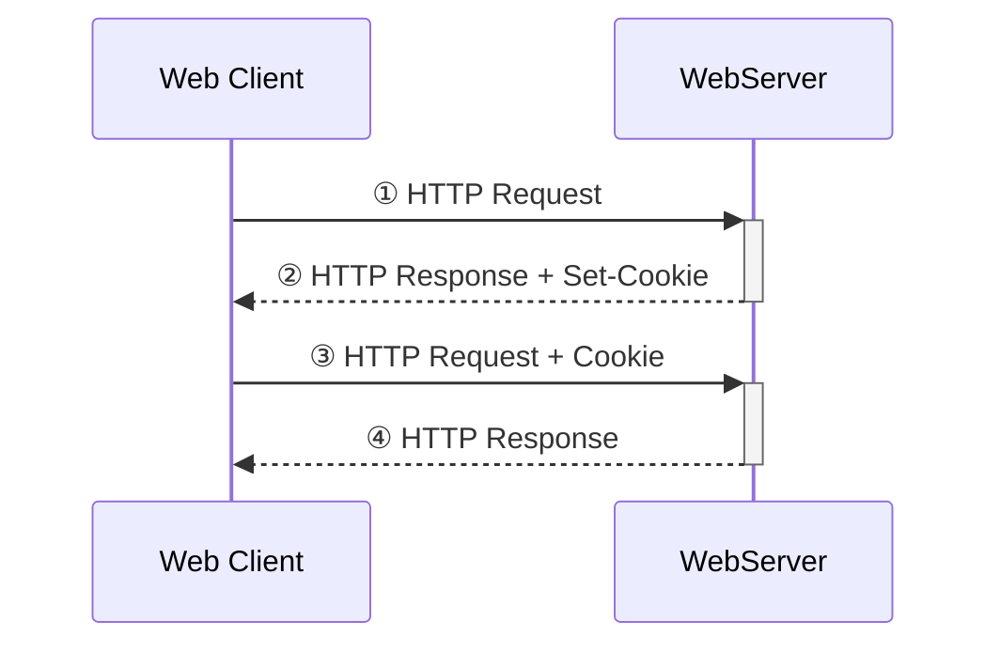

## cookie是什么

cookie是一个保存在客户机中的简单的文本文件, 这个文件与特定的 Web 文档关联在一起, 保存了该客户机访问这个Web 文档时的信息, 当客户机再次访问这个 Web 文档时这些信息可供该文档使用。
由于“Cookie”具有可以保存在客户机上的神奇特性, 因此它可以帮助我们实现记录用户个人信息的功能, 而这一切都不必使用复杂的CGI等程序


HTTP协议本身是无状态的，即服务器无法判断用户身份。Cookie实际上是一小段的文本信息（key-value格式）。
一个 Web 站点可能会为每一个访问者产生一个唯一的ID, 然后以 Cookie 文件的形式保存在每个用户的机器上。
<!--more-->
### 组成

Cookie是一段不超过4KB的小型文本数据，由一个名称（Name）、一个值（Value）和其它几个用于控制Cookie有效期、安全性、使用范围的可选属性组成。

- **Name/Value**
  - 设置Cookie的名称及相对应的值，对于认证Cookie；Value值包括Web服务器所提供的访问令牌。
- Expires属性
  - 设置Cookie的生存期。有两种存储类型的Cookie：会话性与持久性。Expires属性缺省时，为会话性Cookie，仅保存在客户端内存中，并在用户关闭浏览器时失效；持久性Cookie会保存在用户的硬盘中，直至生存期到或用户直接在网页中单击“注销”等按钮结束会话时才会失效。
- Path属性
  - 定义了Web站点上可以访问该Cookie的目录。
- Domain属性
  - 指定了可以访问该 Cookie 的 Web 站点或域。Cookie 机制并未遵循严格的同源策略，允许一个子域可以设置或获取其父域的 Cookie。
- Secure属性
  - 指定是否使用HTTPS安全协议发送Cookie。
- HTTPOnly属性
  - 用于防止客户端脚本通过document.cookie属性访问Cookie，有助于保护Cookie不被跨站脚本攻击窃取或篡改。

## cookie工作流程



## 使用js操作cookie

> JavaScript 可以使用 document.cookie 属性来创建 、读取、及删除 cookie。

```javascript
document.cookie="username=John Doe; expires=Thu, 18 Dec 2043 12:00:00 GMT; path=/";
```

## 参考文章 & 更多

- [百度百科 - cookie](https://baike.baidu.com/item/cookie/1119?fr=aladdin)
- [简书](https://www.jianshu.com/p/6fc9cea6daa2)
- [使用js操作cookie](https://www.runoob.com/js/js-cookies.html)
